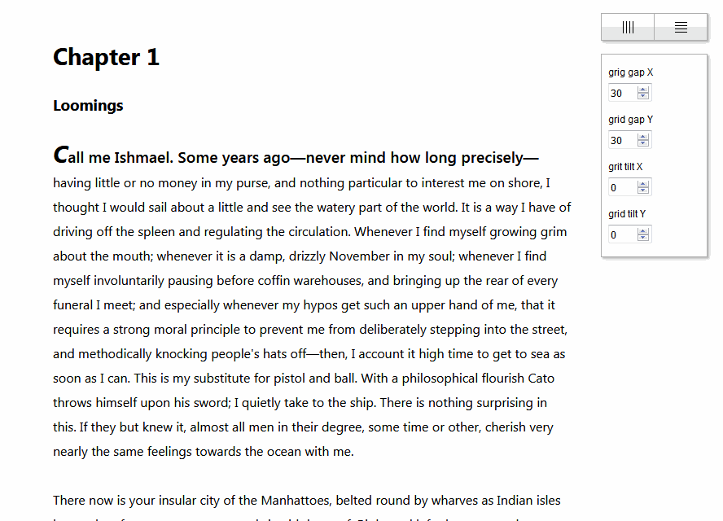

# grid-toggler

A simple one-file javascript tool for better maintainance of vertical and/or horizontal rhytm of webpage components.



## Demo

You can see demo at https://hyneks.github.io/gt-demo/.

## Prerequisites

The script is written in ES6, so it will work only on browsers which supports it's (pretty basic) features.

## Installing

Download and include the script right before the enclosing </body> tag:

```html
<script src='relative-path-to-file/gridtoggler-0.1.0.js'></script>
```

You can configure the settings in the *config* object at the top of the JS file. The scripts currently supports only pixel values.

```javascript
const config = {
    targetX: '#grid',
    targetY: 'body',
    gridGapX: 30,
    gridGapY: 30,
    gridTiltX: 0,
    gridTiltY: 0,
    gridColor: 'rgb(50, 154, 240)',
};
```

## Major Todos

- Make config form collapsible.
- Resolve some issues experienced in Google Chrome: The on-the-fly changing of values is quite laggy. Some lines are seemingly ommited from grid.
- Enable saving the configuration via config form submit (probably to a cookie).
- Probably move the whole config object to a separate JSON file.
- Enable usage of non-pixel values.

## License

This project is licensed under the MIT License - see the [LICENSE.md](LICENSE.md) file for details.